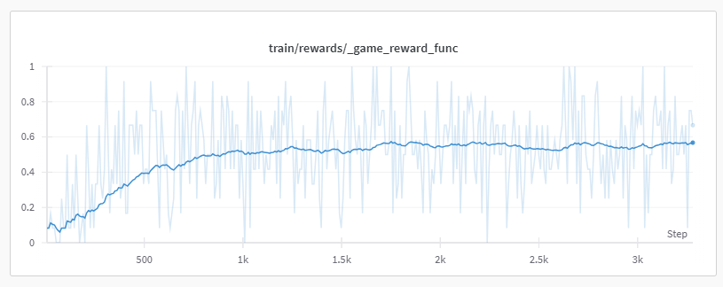
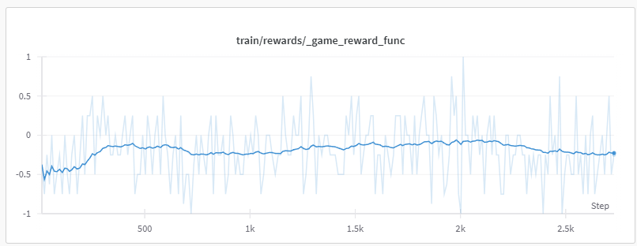

The plan of this fork was to build up to this in a few steps:

- Play a simple game, like Frozenlake
- Play a simple PvP game, Connect 4 was chosen. First play the game vs an AI algorithm, then learn it with self-play.
- Repeat the same steps as with Connect 4, but on Pokemon Showdown random battles.

This was a bit ambitious, and a bit early for the current state of LLM RL.

Here is a brief description of the experiments done.

## Frozenlake

The Frozenlake environment can be pretty successfully learned by an LLM.
However, in this simple example we already notice some limitations:

- The base models are terrible at understanding grids; they pretty much start with random moves.
- Some games can have long context. For this, a context compression logic was implemented. This changes the conversation history into an array of conversations, with the conversation being reset when the token limit is about to be reached.
- Learning this simple task was very slow. And didn't even reach a good performance, the average game reward reaching 56% using QWEN 1.5B as the base model, meaning the model only finishes the track 56% of the time.

While perhaps better results could have been obtained with a 7B model or larger, I am unsure since even the base 7B model is very bad at the task by default.
Furthermore, reasoning traces seems totally useless on tasks where the model doesn't have a baseline performance, because the traces don't make any sense and are not related to the answers.

## Connect Four

To easily implement this, code from this repo was used:
https://github.com/lucasBertola/Connect-4-Gym-env-Reinforcement-learning

But even against a "BabyPlayer" (that plays randomly unless it sees a move that can align 4), the Qwen 1.5B model couldn't learn to beat it consistently. Showing no progress at all, even after receiving some positive rewards.

This probably highlights that current LLM RL algorithms are not efficient at sparse multi-turn tasks. Actually, as far as I know, as of July 2025, there is not a single example of an open-source LLM trained on sparse multi-turn envs.

For this reason, I have decided to not continue experiments with self-play, etc. I will try again if open-source research starts showing promising results on these.

Instead, a similar problem that I think could be solvable by today's algorithms is making an LLM reason on chess, because it can be treated as a single-turn env, where the reward is the change in Stockfish evaluation.

## Implemented Features

- Context compression: This stores an array of conversations instead of a single conversation per rollout. This allows resetting the conversation by adding a new entry to the conversation array. In theory, for Pokemon Showdown, a model could learn to write a message that summarizes the history so far, being able to keep the information about current strategy and player patterns and pass it to the next conversation.
